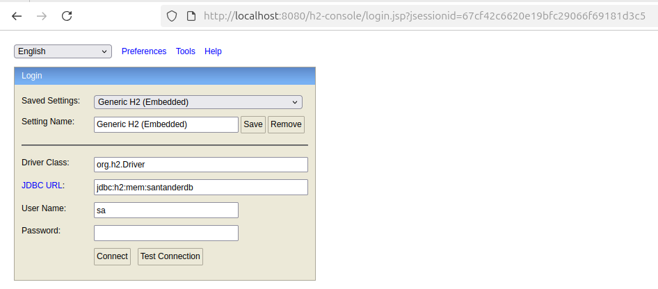
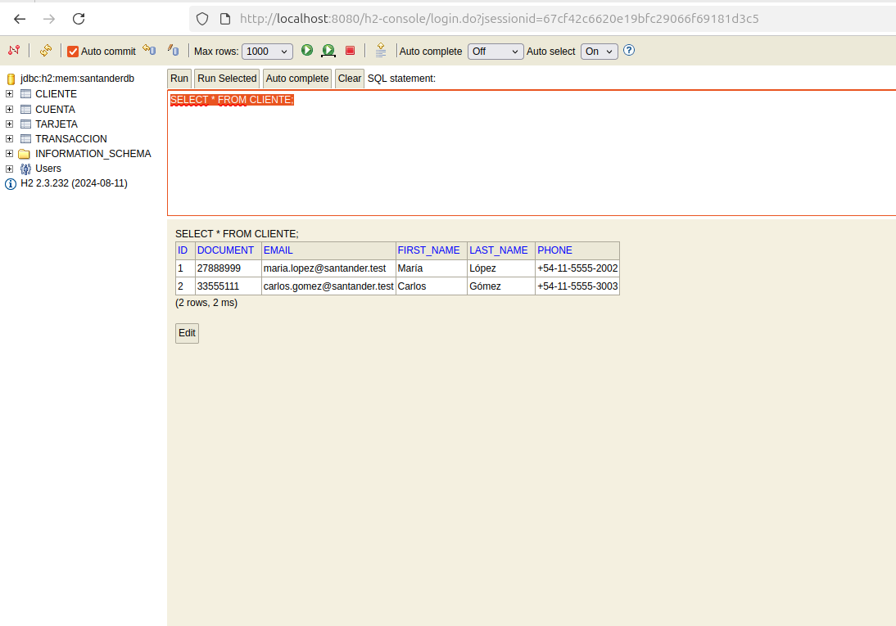
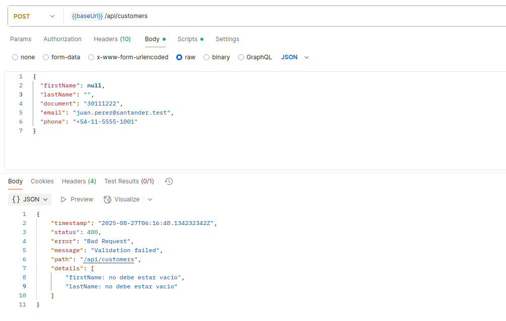
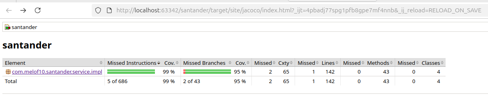
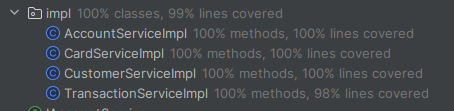

# Santander API (Spring Boot + H2 + Swagger)

API para challenge Banco Santander (clientes, cuentas, tarjetas y transacciones) construida con **Spring Boot 3**, **JPA/Hibernate**, **H2 en memoria** y **Swagger (springdoc-openapi)**.

**Se puede ver un video de los diferentes casos de uso de la api en** `src/main/resources/docs/videos/use_cases_api.mp4`

> **Base URL:** `http://localhost:8080`  
> **Endpoints API:** `http://localhost:8080/api/**`  
> **Swagger UI:** `http://localhost:8080/swagger-ui.html`  
> **H2 Console:** `http://localhost:8080/h2-console`  
> **Postman collection:** `src/main/resources/docs/postman/Santander_Challenge.postman_collection.json`

---

**La consigna se puede encontrar en** `src/main/resources/docs/ejercicio_practico_1_entrevistas 2.docx`

---

## 🧰 Requisitos
- **Java 21**
- **Maven 3.9+**
- (Opcional) **cURL** o **Postman**

---

## 🚀 Cómo levantar la aplicación

### Con Maven
```bash
./mvnw spring-boot:run
```

### Con Gradle
```bash
./gradlew bootRun
```

### JAR ejecutable
```bash
# Maven
./mvnw clean package
java -jar target/santander-*.jar

# Gradle
./gradlew clean bootJar
java -jar build/libs/santander-*.jar
```

Una vez iniciada, la app estará en `http://localhost:8080`.

---

## ⚙️ Configuración por defecto (H2 + JPA + Swagger)

Asegúrate de tener estas propiedades en `src/main/resources/application.properties`:

```properties
# --- H2 en memoria ---
spring.datasource.url=jdbc:h2:mem:santanderdb;DB_CLOSE_DELAY=-1;DB_CLOSE_ON_EXIT=FALSE
spring.datasource.driverClassName=org.h2.Driver
spring.datasource.username=sa
spring.datasource.password=

# --- JPA/Hibernate ---
spring.jpa.hibernate.ddl-auto=create
spring.jpa.show-sql=true
spring.jpa.properties.hibernate.format_sql=true

# --- Consola H2 ---
spring.h2.console.enabled=true
spring.h2.console.path=/h2-console

# --- Swagger / OpenAPI ---
springdoc.api-docs.enabled=true
springdoc.swagger-ui.enabled=true
springdoc.swagger-ui.path=/swagger-ui.html
```

> `spring.jpa.hibernate.ddl-auto=create` crea las tablas a partir de las entidades JPA al arrancar.  
> Si querés datos de ejemplo, agregá un `data.sql` (ver más abajo).

---

## 🗂️ Estructura del proyecto

```
src/
 ├─ main/
 │   ├─ java/com/melof10/santander
 │   │   ├─ client                                      # Cliente WebClient para consumir servicio
 │   │   ├─ config                                      # Clases relacionadas a la configuración del proyecto
 │   │   ├─ controller/rest, request, response          # Controllers REST
 │   │   ├─ service/impl                                # Servicios con sus respectivas implementaciones
 │   │   ├─ repository                                  # Repositorios JPA
 │   │   ├─ entity                                      # Entidades JPA
 │   │   ├─ enums                                       # Enums para evitar el uso de clases innecesarios
 │   │   └─ config                                      # Configs (Swagger, Security, etc.)
 │   └─ resources/
 │       ├─ application.properties
 │       └─ postman/
 │           └─ Santander.postman_collection.json
 └─ test/...
```

---

## 🧭 Ver Swagger (documentación interactiva)

- **UI:** `http://localhost:8080/swagger-ui.html`  
- **JSON OpenAPI:** `http://localhost:8080/v3/api-docs`

> Si usás Spring Security, recordá permitir: `/v3/api-docs/**`, `/swagger-ui/**`, `/swagger-ui.html`.

---

## 🗄️ Ver H2 Console

1. Ir a `http://localhost:8080/h2-console`  
2. Completar con:  
   - **JDBC URL:** `jdbc:h2:mem:santanderdb`  
   - **User:** `sa`  
   - **Password:** _(vacío)_  
3. Click en **Connect**.

> Si no abre, verificá `spring.h2.console.enabled=true` y `spring.h2.console.path=/h2-console`.




---

## 📬 Colección de Postman

La colección se encuentra en:
```
src/main/resources/docs/postman/Santander_Challenge.postman_collection.json
```

**Cómo importar en Postman:**
1. Abrí Postman → **Import**.  
2. Seleccioná el archivo de la ruta anterior.  
3. Si la colección usa variable base, seteá `{{baseUrl}} = http://localhost:8080`.

---

## 🧪 Datos de prueba (opcional)

Agregá `src/main/resources/data.sql` para insertar datos al inicio. Ejemplo:

```sql
INSERT INTO cliente (id_cliente, nombre, apellido, documento, email, telefono)
VALUES (1, 'John', 'Doe', '12345678', 'john@example.com', '555-1234');

INSERT INTO cuenta (id_cuenta, numero_cuenta, tipo_cuenta, saldo, fecha_apertura, id_cliente)
VALUES (1, 'ACC-1001', 'SAVINGS', 1500.00, CURRENT_DATE, 1);
```

> Ajustá nombres de tablas/columnas si cambian tus anotaciones JPA.

---

## 🔌 Endpoints de ejemplo (cURL)

### Accounts
```bash
# Crear cuenta
curl -X POST http://localhost:8080/api/accounts   -H "Content-Type: application/json"   -d '{"customerId":1,"accountNumber":"ACC-2001","accountType":"SAVINGS","balance":1000.00}'

# Obtener por id
curl http://localhost:8080/api/accounts/1

# Listar
curl http://localhost:8080/api/accounts
```

### Transactions
```bash
# Depósito
curl -X POST http://localhost:8080/api/transactions   -H "Content-Type: application/json"   -d '{"type":"DEPOSITO","destinationAccountId":1,"amount":500.00}'

# Extracción (puede devolver "Saldo insuficiente")
curl -X POST http://localhost:8080/api/transactions   -H "Content-Type: application/json"   -d '{"type":"EXTRACCION","sourceAccountId":1,"amount":2000.00}'

# Transferencia
curl -X POST http://localhost:8080/api/transactions   -H "Content-Type: application/json"   -d '{"type":"TRANSFERENCIA","sourceAccountId":1,"destinationAccountId":2,"amount":250.00}'
```

---

## 🛡️ Manejo de errores

La app incluye un `@RestControllerAdvice` para respuestas de error uniformes. Ejemplo ante regla de negocio:

```json
{
  "timestamp": "2025-08-27T12:34:56.789Z",
  "status": 500,
  "error": "Internal Server Error",
  "message": "Saldo insuficiente",
  "path": "/api/transactions"
}
```

En el caso de que se encuentre un campo nulo o vacío va a arrojar una excepción controlada identificando dicho campos 
y arojando una excepción controlada. Ejemplo ante regla de datos de entrada en el endpoint /api/customers para crear un 
usuario <br> <br>


---

## ✅ Unit Tests y Coverage (JaCoCo)

El proyecto incluye **tests unitarios** para los servicios (`service.impl`).  
Se integró el plugin **JaCoCo** para medir cobertura de líneas y ramas.

### Ejecutar los tests
```bash
mvn clean verify
```


### Reporte HTML de cobertura
Se genera en:
```
target/site/jacoco/index.html
```




### Umbral de cobertura
El build falla si la cobertura de la capa `service.impl` es inferior al **80%** en líneas o ramas.

Esto asegura que la lógica de negocio esté correctamente testeada y mantenida.

